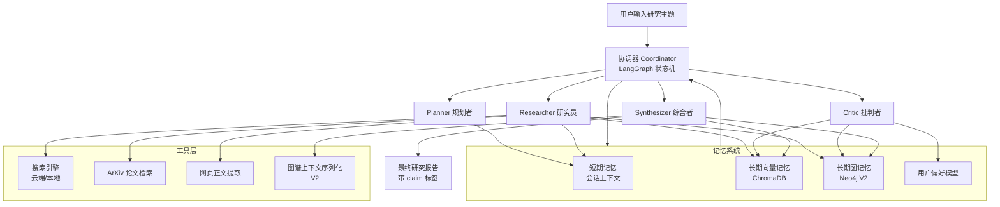
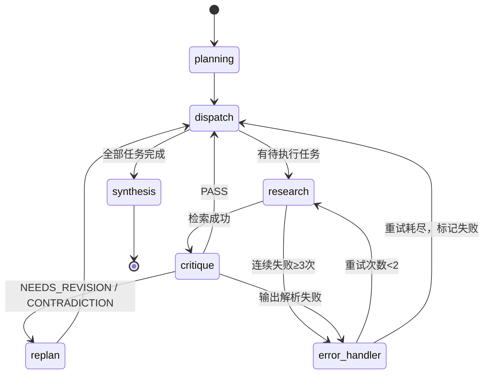

# Synapse —— 个人长期研究助手多智能体系统
## 项目大纲文档 v1.3

> v1.3 修订：统一核心指标口径（§1.1/§1.3 对齐 §2、§11）、补充嵌入模型选型与成本估算、明确评估测试主题与 claim 匹配校验方式、阶段 4 调整为两星期弹性交付

---

## 目录
1. [项目概述](#1-项目概述)
2. [核心价值与深度体现](#2-核心价值与深度体现)
3. [技术栈选型与决策依据](#3-技术栈选型与决策依据)
4. [系统架构设计](#4-系统架构设计)
5. [多智能体角色设计](#5-多智能体角色设计)
6. [记忆系统设计](#6-记忆系统设计)
7. [Reflection 自我改进机制](#7-reflection-自我改进机制)
8. [协调器与状态图设计](#8-协调器与状态图设计)
9. [数据源与工具集](#9-数据源与工具集)
10. [项目结构与代码规范](#10-项目结构与代码规范)
11. [MVP 分阶段实施计划](#11-mvp-分阶段实施计划)
12. [测试与评估体系](#12-测试与评估体系)
13. [已知局限与风险权衡](#13-已知局限与风险权衡)
14. [V2 进阶特性展望](#14-v2-进阶特性展望)
15. [求职展示与博客策略](#15-求职展示与博客策略)
16. [开发规范与协作约定](#16-开发规范与协作约定)
17. [附录：核心数据 Schema](#17-附录核心数据-schema)

---

## 1. 项目概述
### 1.1 项目定位
Synapse 是一款本地部署的**长期研究伴侣多智能体系统**。系统围绕开放式研究主题，通过规划、检索、批判、综合四类专业智能体的分工协作与结构化反思，自动完成信息采集、质量校验、知识沉淀与报告生成全流程。

区别于市面多数「单次对话、会话清零」的玩具级 Agent Demo，Synapse 以**双层长期记忆**为核心底座，支持跨会话知识累积、冲突自动检测、偏好持续学习，研究成果随使用持续沉淀，最终成长为高度适配个人研究习惯的专属知识助手。

### 1.2 核心创新点
1. **真正的跨会话知识沉淀**：研究结论永久存储于向量记忆库，相似主题二次研究检索调用量下降 35% 以上、完成速度提升 40% 以上，避免重复劳动
2. **可落地的结构化反思机制**：批判环节具备明确的评分规则与分级处理逻辑，而非形式化的 Prompt 话术，设计目标与验收口径均为将结论幻觉率压制在 5% 以内（见 §12 评估体系）
3. **全链路证据可追溯**：最终报告每一条论断均绑定来源 URL、原文摘录与可信度评分，支持一键溯源到原始数据
4. **本地优先设计**：支持本地大模型 + 本地搜索引擎 + 本地向量库全栈本地化，数据零外泄，成本可控

### 1.3 典型用户故事
> **场景**：研究生小王需要调研「大模型幻觉缓解技术」方向，准备写一篇综述。
>
> **第一次研究**：小王输入主题，Synapse 自动拆解为 6 个子任务，Researcher 检索了 20+ 篇论文和技术博客，Critic 驳回了 2 个证据不足的任务并触发补充检索，最终生成一份 3000 字的结构化报告，附带 12 个引用来源。小王对报告点了赞，并标记其中 2 篇论文为「重点关注」。
>
> **两周后第二次研究**：小王想进一步了解「RLHF 与 RAG 在幻觉缓解上的对比」。Synapse 启动时自动从向量记忆中召回上次研究中与 RLHF、RAG 相关的 8 个片段，Planner 基于已有知识只新增了 3 个补充任务，检索调用量下降 35%，报告生成速度提升 40%。Critic 还发现新检索到的一篇博客结论与上次记忆中的顶会论文结论矛盾，自动标记为「争议点」并在报告中并列呈现。
>
> **一个月后第三次研究**：小王转向「Agent 系统中的幻觉问题」。Synapse 自动关联前两次研究的核心概念，推荐了 3 篇高度相关的历史论文，用户偏好模型已记住小王信任 ArXiv 多于技术博客的倾向，检索结果自动按来源权重排序。

### 1.4 能力边界
- 适用场景：学术综述、行业调研、技术方案对比、趋势分析等事实类研究主题
- 不适用场景：强创造性写作、纯主观审美判断、需要实时涉密数据的课题

---

## 2. 核心价值与深度体现

| 深度维度 | 具体实现 | 量化效果预期 |
|----------|----------|--------------|
| **双层记忆系统** | 短期记忆（会话窗口+动态摘要压缩）+ 长期记忆（ChromaDB 向量存储研究片段 + Neo4j 图存储概念实体关系，V2 引入），支持跨会话知识复用、冲突检测与增量更新 | 相似主题二次研究，API 调用量下降 ≥35%，完成速度提升 ≥40% |
| **多智能体协同** | Planner、Researcher、Critic、Synthesizer 四角色权责分离，由 LangGraph 状态机统一编排，支持并行检索、动态任务插入与异常回退 | 单主题可自动拆解 3-8 个子任务，并行检索效率提升 2-3 倍 |
| **结构化 Reflection** | Critic 执行「来源权威性-逻辑一致性-历史兼容性-任务匹配度」四维校验，发现问题自动触发补充检索或重规划，形成质量闭环 | 报告幻觉率 ≤5%，单任务平均经历 1.2 轮反思即可达标 |
| **全链路可追溯** | 研究片段与最终报告论断一一映射，每条结论附带来源、原文片段、可信度评分 | 引用密度 ≥1 次/500 字，100% 核心论断可溯源 |
| **本地优先架构** | 支持本地大模型（Ollama）+ 本地搜索引擎（SearXNG）+ 本地向量库全栈本地化 | 零外部 API 依赖即可运行，数据完全留存本地 |
| **持续学习进化** | 用户偏好模型随交互自动调整检索策略；概念图谱随研究主题持续丰富，支持关联推理与趋势发现 | 连续使用 5 个主题后，任务规划贴合度提升 30% |

---

## 3. 技术栈选型与决策依据

| 层级 | 组件选型 | 核心作用 | 选型理由与备注 |
|------|----------|----------|----------------|
| 大模型层 | deepseek（文本模型）+Qwen-VL（视觉模型，V2 可选启用） | 各智能体推理核心 | 云端强模型保证质量；本地模型降低成本、保护隐私。通过抽象工厂封装，支持按任务难度动态路由：简单检索/规划用本地模型，Critic/Synthesis 用强模型。Qwen-VL 用于论文图表/截图解析（见 §9、§14），MVP 不启用，避免范围蔓延 |
| 编排框架 | LangGraph | 多节点状态机构建与循环控制 | 原生支持条件边、状态持久化、可中断流程，最适合多 Agent 闭环工作流 |
| 短期记忆 | LangGraph State + 自定义滑动窗口 | 会话上下文管理 | 轻量无额外依赖，配合摘要压缩算法控制 Token 成本 |
| 向量记忆 | ChromaDB（MVP）/ Milvus 或 Qdrant（V2 可升级） | 研究片段语义存储与相似召回 | ChromaDB 本地部署、Python 原生支持、轻量易上手，适合单机 MVP 验证；数据量大时可平滑迁移到 Milvus/Qdrant |
| 嵌入模型 | BGE-M3（本地，sentence-transformers 加载） | 文本向量化，支撑语义召回与去重 | 本地部署、中英文均衡、支持 8K 长文本，保证「全链路本地化、数据零外泄」声明成立；模型权重通过 Docker 卷挂载，启动即用 | 
| 图记忆 | Neo4j（V2 引入） | 概念、论文、实体关系建模 | 业界最成熟的属性图数据库，Cypher 查询灵活，适合知识推理。MVP 阶段暂不引入，降低初期复杂度 |
| 工具层 | SerpAPI / Brave Search（云端）+ SearXNG（本地备选）、ArXiv API、Trafilatura | 信息检索与内容解析 | 云端 API 质量高但有额度限制；SearXNG 本地部署零成本无限制，更符合「本地优先」理念，作为备选方案 |
| 可观测性 | LangFuse | 全链路 Token、延迟、流程追踪 | 开源可本地部署，成本透明，便于调试与性能优化。阶段 1 即建立，避免后期调试地狱 |
| 前端展示 | Streamlit | 过程可视化与报告预览 | 低代码快速搭建，适合演示原型，无需投入大量前端工作量 |
| 部署环境 | Docker Compose | 依赖服务一键启动 | 环境一致性强，便于他人复现与本地部署 |

---

## 4. 系统架构设计



### 架构设计原则
1. **职责单一**：协调器仅负责流程调度与消息路由，各智能体独立读写记忆，避免中心化瓶颈
2. **记忆前置**：Researcher 执行任务前优先检索长期记忆，命中则直接复用，降低重复成本
3. **闭环校验**：所有研究产出必须经过 Critic 审核才能进入综合阶段，从流程上抑制幻觉
4. **本地优先**：核心组件均可本地部署，数据零外泄；云端服务作为可选增强
5. **可插拔设计**：模型、搜索引擎、向量库均通过抽象层封装，可无缝替换升级
6. **可观测先行**：阶段 1 即建立完整日志体系，每个节点输入输出全量记录，避免调试黑洞

---

## 5. 多智能体角色设计

### 5.1 Planner（规划者）
- **核心职责**：将研究主题拆解为层级化任务 DAG，动态追踪进度并支持重规划
- **输入**：用户主题 + 历史向量记忆检索结果 + 已完成任务反馈 + Critic 结构化修正指令
- **输出**：结构化任务列表，包含任务 ID、描述、优先级、依赖关系、执行主体、状态、建议检索关键词
- **行为约束**：单主题任务数控制在 3-8 个；收到 Critic 修正指令后直接挂入任务 DAG，不做二次猜测
- **模型路由**：MVP 阶段可用本地模型执行，降低成本

### 5.2 Researcher（研究员）
- **核心职责**：执行具体检索任务，提取结构化信息并写入向量记忆
- **工具权限**：网页搜索、论文检索、正文提取、向量记忆读写
- **输出标准**：统一格式研究片段，包含来源信息、核心 claims 列表、原文摘录、可信度评分
- **行为约束**：
  - 连续 3 次搜索无结果必须上报 Coordinator，触发任务失败或重规划
  - 基于 claims 做细粒度去重：若新片段超过 80% 的 claims 与历史片段重合，视为重复，跳过写入
  - 高相似度内容直接复用不再重复抓取
- **模型路由**：基础检索与提取可用本地模型；复杂网页理解用强模型

### 5.3 Critic（批判者）
- **核心职责**：执行结构化反思，对研究片段做质量把关与冲突检测
- **四维审核标准**：来源可信度、内部逻辑一致性、历史知识兼容性、任务匹配度
- **裁决分级**：`PASS`（通过）/ `NEEDS_REVISION`（需补充）/ `CONTRADICTION`（事实矛盾）
- **输出格式**：结构化反思报告 + 补充任务单（若需修订）
  - 补充任务单包含：明确的搜索 query、目标信息点、优先级，直接挂入任务 DAG
- **特殊权限**：可要求深度阅读指定来源，或通知 Planner 新增澄清任务
- **模型路由**：必须使用强模型，保证审核质量

### 5.4 Synthesizer（综合者）
- **核心职责**：将所有通过审核的研究片段组织为结构化研究报告
- **输入**：全部通过片段 + 图谱上下文（V2）+ 用户风格偏好
- **输出结构**：摘要 → 背景综述 → 核心分支对比 → 争议点 → 趋势展望 → 参考文献
- **输出规范**：所有核心论断必须用 `<claim ref="snippet_id">...</claim>` 标签包裹，便于自动提取与幻觉率计算
- **行为约束**：所有核心论断必须标注对应来源；存疑内容必须明确标注「存疑」说明
- **模型路由**：必须使用强模型，保证报告质量

### 5.5 Coordinator（协调器）
非智能体角色，由 LangGraph 状态机实现，负责：
- 全局任务队列维护与状态同步
- 节点间消息路由与条件跳转
- 并发控制（限制并行检索数，避免触发 API 限流）
- 全局异常捕获与重试机制
- 全链路日志记录与可观测性对接

---

## 6. 记忆系统设计
采用「短期-长期」分层架构，MVP 阶段落地向量记忆，图记忆作为 V2 进阶特性。

### 6.1 短期记忆（会话级）
- 载体：LangGraph State 中的对话历史字段
- 管理机制：Token 超阈值时对早期对话执行摘要压缩，保留最近 N 轮完整对话 + 历史摘要
- 生命周期：随会话创建初始化，会话结束后关键结论沉淀至长期记忆

### 6.2 长期向量记忆（ChromaDB）
- 存储单元：研究片段文本内容（嵌入模型：本地 BGE-M3，保证向量化环节同样零外泄）
- 元数据字段：来源 URL、类型、可信度、发表时间、主题标签、claims 列表
- 核心能力：批量写入、语义相似召回、主题筛选、细粒度去重
- **去重规则（细粒度）**：
  1. 粗筛：余弦相似度 > 0.90 的候选片段进入细判
  2. 细判：提取新片段的 claims 列表，与候选片段的 claims 逐一比对，若重合率 > 80%，则视为重复，跳过写入
  3. Researcher 在输出片段时一并提取 claims，避免额外 LLM 调用

### 6.3 长期图记忆（Neo4j，V2）
- 节点类型：`Topic`、`Paper`、`Author`、`Institution`、`KeyConcept`、`Claim`
- 关系类型：`RELATED_TO`、`CITES`、`AUTHORED_BY`、`SUPPORTS`、`REFUTES`
- **构建机制（异步批量）**：后台队列攒够 N 个通过审核的片段后，统一调用一次 LLM 做实体关系抽取，合并已有图谱。避免每次写入都调 LLM，降低成本和延迟
- **图谱上下文序列化**：抽取与当前主题相关的 2 跳子图，转换为自然语言描述（如「概念 A 与概念 B 相关，由论文 C 支持，作者为 D」），作为 Synthesizer 的上下文输入
- 核心价值：沉淀结构化知识网络，支持关联推理与跨主题趋势发现

### 6.4 记忆写入与淘汰规则
- **写入门槛**：仅 Critic 审核通过且可信度评分 ≥ 7 分的片段可写入长期记忆
- **冲突处理**：新片段与历史知识存在事实矛盾时，标记为「争议点」并存，不直接覆盖旧知识
- **过期清理**：超过 2 年的低可信度内容自动降级，检索时降低权重

### 6.5 用户偏好模型
- **MVP 实现**：仅支持显式反馈（报告生成后提供「满意/一般/不满意」+「来源偏好」快速评分按钮），直接写入 JSON 配置
- **V2 增强**：结合隐式行为（追问方向、阅读深度），定期总结更新
- 记录维度：偏好信息来源、内容深度倾向、感兴趣研究方向、报告风格偏好

---

## 7. Reflection 自我改进机制
Reflection 是由 Critic 驱动的结构化质量闭环，是系统抑制幻觉、提升可信度的核心机制。

### 7.1 工作全流程
1. **接收证据包**：获取当前任务产出的全部研究片段
2. **单片段审核**：逐一片段做来源评分、逻辑检查、相关性评估
3. **交叉一致性校验**：对比同任务下多个片段观点，识别内部矛盾
4. **历史冲突检测**：检索长期记忆，比对与历史知识的兼容性
5. **生成反思报告**：汇总所有问题，输出整体裁决与具体修正指令
6. **补充任务生成**：若裁决非 PASS，同步生成结构化补充任务单
7. **结果分发执行**：根据裁决结果分流处理
8. **循环终止判定**：达到最大轮次则强制降级，避免死循环

### 7.2 可信度评分规则
采用加权打分制，而非 LLM 主观判定：
- **来源类型权重 60%**：
  - 正式出版物（有 DOI、期刊/会议名）：10 分
  - 预印本（ArXiv 等）：7 分
  - 权威机构/公司官方文档：8 分
  - 主流科技媒体：6 分
  - 个人博客/论坛：4 分
- **交叉验证权重 30%**：
  - 判定规则：当两个及以上片段指向同一事实，且来源不同、且来源之间无直接引用关系，认定为独立印证
  - 3 个以上独立来源印证：满分 30 分
  - 2 个独立来源印证：20 分
  - 单一来源：10 分
- **时效性权重 10%**：
  - 近 2 年内：10 分
  - 2-3 年：7 分
  - 超过 3 年：逐年衰减

### 7.3 冲突分级与处理策略
- **事实级冲突**：数据、结论直接相反
  - 处理：触发补充检索，新增权威来源验证
  - 降级：若 2 轮反思后仍无法裁定，标记为「未解决矛盾」，在报告中并列呈现双方观点并注明无法裁定
- **视角级差异**：立场不同但事实一致
  - 处理：报告中并列呈现双方观点，不做强制统一
- **定义级分歧**：概念定义或口径不同
  - 处理：补充背景说明，明确各自前提

### 7.4 循环终止与降级机制
- 单任务最多允许 2 轮 Reflection
- 2 轮后仍未通过：标记为「存疑结论」写入报告并明确标注，不再继续循环
- 连续 3 个任务触发矛盾：通知 Planner 重新评估研究方向合理性

---

## 8. 协调器与状态图设计

### 8.1 全局状态核心字段
- 研究主题与用户配置
- 任务图谱（全量任务列表与状态）
- 当前执行任务 ID 与反思轮次计数
- 已产出研究片段集合
- 最近一次批判审核结果 + 补充任务单
- 已通过审核片段集合
- 最终报告内容
- 记忆检索上下文
- 全局错误计数与重试记录

### 8.2 核心节点定义
- `planning`：调用 Planner 生成初始任务 DAG
- `dispatch`：任务调度器，选取下一个就绪任务
- `research`：Researcher 执行单任务检索
- `critique`：Critic 执行反思审核
- `replan`：Planner 根据审核结果（补充任务单）调整任务图谱
- `synthesis`：Synthesizer 生成最终报告
- `error_handler`：全局异常处理节点（格式解析失败、网络超时等）

### 8.3 状态转换逻辑


### 8.4 异常处理策略
- **LLM 输出格式失败**：使用 OutputFixingParser 自动修复；修复失败则重试（最多 2 次）；仍失败则跳过当前任务并记录
- **工具调用失败（网络超时、限流）**：指数退避重试（最多 3 次）；仍失败则上报 Coordinator
- **Researcher 连续无结果**：连续 3 次搜索无结果，标记任务失败，跳转到 dispatch 继续下一任务
- **Human-in-the-loop（V2 可选）**：CONTRADICTION 且 2 轮无法解决时，暂停并等待用户干预

---

## 9. 数据源与工具集
全部采用公开可获取、具备免费额度或可本地部署的数据源，确保项目可复现。

| 工具类别 | 实现方案 | 核心用途 | 备注 |
|----------|----------|----------|------|
| 通用网页搜索 | 云端：SerpAPI / Brave Search<br/>本地：SearXNG（Docker 部署） | 全网公开信息检索 | 云端质量高有额度；本地零成本无限用，默认优先本地 |
| 学术论文检索 | arxiv Python SDK | ArXiv 论文元数据与摘要获取 | 完全免费 |
| 网页正文提取 | Trafilatura + requests | 过滤广告与导航，提取纯文本内容 | 本地运行，无成本 |
| PDF 解析工具 | PyMuPDF (fitz) | 论文全文解析与分段（可选深度阅读） | 本地运行；V2 可选叠加 Qwen-VL 解析论文插图与表格 |
| 向量记忆工具 | 封装 ChromaDB 客户端 | 长期向量记忆的读写与检索 | 本地部署 |
| 图记忆工具 | 封装 Neo4j Python Driver（V2） | 概念图谱的增删改查 | V2 引入 |
| 用户配置工具 | JSON 文件读写 | 用户偏好的读取与更新 | 轻量无依赖 |

**工具封装原则**：
- 全部使用 Pydantic 定义输入输出 Schema
- 统一指数退避重试与异常降级逻辑
- 支持 mock 模式，方便无网调试
- 全量调用日志记录，支持成本统计与问题排查

---

## 10. 项目结构与代码规范

### 项目分层目录
```
synapse/
├── 配置层：全局设置、环境变量、各智能体提示词模板
├── 核心编排层：状态数据结构、LangGraph 状态图、消息总线、异常处理
├── 智能体层：四个角色独立实现 + 智能体基类 + 输出解析器
├── 记忆系统层：短期记忆、向量记忆、图记忆（V2）、用户偏好模型
├── 工具层：各类外部工具的封装实现 + 通用重试装饰器
├── 模型层：大模型工厂 + 路由策略（按任务难度分配模型）
├── 可观测层：LangFuse 集成 + 日志配置
├── 测试目录：单元测试 + 集成测试
├── 评估目录：基准测试主题集 + 自动评分脚本
├── 示例目录：产出报告样例
└── 脚本目录：数据库初始化、SearXNG 部署等辅助脚本
```

### 代码规范要求
- 类型注解覆盖率 > 90%
- 公共类与方法附带规范文档说明
- 统一代码格式化风格（black + isort）
- 配置与密钥完全通过环境变量注入
- 核心逻辑模块附带单元测试
- 所有 LLM 调用必须经过 OutputFixingParser 或等价校验层

---

## 11. MVP 分阶段实施计划
遵循「先跑通核心闭环，再做增强能力」原则，适当调整节奏确保高质量交付。
**总周期：5 周**（阶段 4 跨第 4-5 周，交付物按弹性顺序排列）

### 阶段 1：基础骨架 + 单智能体检索（第 1 周）
**核心目标**：跑通「输入主题 → 检索 → 向量记忆」基础链路，建立可观测体系
- 搭建 ChromaDB 环境，完成向量记忆封装
- 实现 Researcher 智能体，支持网页搜索（SearXNG 本地）与论文检索
- 实现短期记忆滑动窗口管理
- 完成研究片段结构化输出规范（含 claims 提取）
- **建立 LangFuse 日志体系**，每个节点输入输出全量记录
- 实现大模型工厂 + 本地模型（Ollama）适配
- **验收标准**：同一主题两次查询（非相似主题，口径说明见 §12.2），历史片段复用率 ≥ 60%；全链路可在 LangFuse 中追踪

### 阶段 2：Reflection 质量闭环（第 2 周）
**核心目标**：引入批判角色，建立审核-重试闭环
- 实现 Critic 智能体与结构化反思逻辑
- 在 LangGraph 中搭建「检索 → 审核 → 重试」条件循环
- 实现简易版 Planner（模板化任务分解）
- 落地可信度评分规则与冲突分级处理
- 实现结构化补充任务单机制
- 加入 OutputFixingParser，处理 LLM 输出格式异常
- **验收标准**：注入矛盾信息时，系统识别率 ≥ 80%，并自动触发补充检索

### 阶段 3：完整多智能体协同（第 3 周）
**核心目标**：四角色全链路跑通，可自动生成完整报告
- 升级 Planner 为 LLM 驱动的动态任务分解
- 实现 Synthesizer 报告生成能力（含 claim 标签化输出）
- 完成完整 Coordinator 状态图与全局异常处理
- 实现用户偏好模型（显式反馈版）
- 完善全局异常处理与重试机制
- **验收标准**：输入开放主题，自动产出 ≥1500 字、≥5 个引用来源的结构化报告；单任务至少经历 1 轮反思

### 阶段 4：跨会话增强 + 可视化交付（第 4-5 周）
**核心目标**：落地向量记忆跨会话能力，完善展示效果，准备求职交付物
- 实现会话启动时历史知识预热，Planner 基于已有知识调整计划
- 完善知识去重与冲突标记机制
- 搭建 Streamlit 极简可视化界面（输入主题 → 实时展示任务分解/检索状态/批判进度/最终报告）
- 完成消融实验脚本与基准测试
- 生成 2-3 份示例报告
- 撰写 README、项目文档（必须交付物，README 包含架构图 + 一键启动命令 + 成本统计脚本）
- 技术博客与 Demo GIF/视频（弹性交付物：时间紧张时顺延至收尾周完成，不影响核心闭环验收）
- **验收标准**：相似主题二次研究，检索 API 调用量下降 ≥ 35%，完成速度提升 ≥ 40%；GitHub 仓库首屏完整可用

> **注**：Neo4j 图记忆、图谱序列化、Human-in-the-loop、隐式偏好学习等特性后移至 V2 版本，确保 MVP 聚焦核心闭环，避免开发复杂性爆炸。

---

## 12. 测试与评估体系

### 12.1 单元测试与集成测试
- **单元测试**：
  - 工具层：Mock 外部 API，测试输入输出解析、异常处理、重试逻辑
  - 记忆层：测试写入、去重（粗筛+细判）、检索、删除的正确性
  - 智能体层：固定输入下验证输出格式合规性（含 OutputFixingParser 修复率）
- **集成测试**：
  - 预设 3 个标准测试主题，覆盖系统主要报告形态：
    - T1「大模型幻觉缓解技术」（综述类）
    - T2「RAG 与微调在领域问答中的对比」（对比类）
    - T3「本地部署 LLM 的方案选型」（方案类）
  - 3 个主题同时用于消融实验（§12.4）与示例报告产出（阶段 4），保证全项目数据口径一致
  - 校验：任务数 ≥3、审核轮次 ≥1、引用数 ≥5、全程无异常中断
  - 支持 mock 模式，离线也可跑通全流程

### 12.2 核心质量指标
| 指标 | 合格标准 | 计算方式 |
|------|----------|----------|
| 引用密度 | ≥ 1 次/500 字 | 总引用数 / 报告字数 |
| 来源可信度均分 | ≥ 7.5/10 | 所有来源可信度评分均值 |
| 幻觉率 | ≤ 5% | 无法溯源的 claim 数 / 总 claim 数 |
| 知识复用率 | ≥ 30% | 命中历史记忆片段数 / 总片段数（相似主题跨会话口径；同一主题二次查询口径为 ≥60%，见阶段 1 验收） |
| 反思有效率 | ≥ 60% | 重审后通过的任务占比 |
| 格式解析成功率 | ≥ 95% | 首次解析成功次数 / 总调用次数 |

### 12.3 幻觉率计算方法
- Synthesizer 输出报告时，所有核心论断必须用 `<claim ref="snippet_id">...</claim>` 标签包裹
- 评估脚本自动提取所有 claim 标签，做两级校验：
  1. **ref 指向校验**：snippet_id 必须真实存在于已通过片段集合，否则直接计为不可溯源
  2. **内容匹配校验**：调用 LLM 评判器对每条 claim 与其 ref 片段做一致性打分，得分 < 0.7 计为该 claim 不可溯源
- 人工抽查 20% 的 claim，计算一致率，修正最终幻觉率；LLM 评判器与人工抽查的一致率 ≥ 90% 时，自动化结果可直接采信（评判器阈值在此校准）

### 12.4 消融实验设计
通过控制变量验证每个模块的真实价值，避免技术堆砌：
- **基线组**：仅 Researcher + Synthesizer，无 Critic、无长期记忆
- **实验组 A**：基线 + Critic Reflection 机制
- **实验组 B**：基线 + 长期向量记忆
- **实验组 C**：完整系统（Critic + 向量记忆 + 用户偏好）

对比四组在以下指标上的差异：
- 幻觉率（越低越好）
- 引用准确率（越高越好）
- 完成时间（越短越好）
- 信息重复率（越低越好）

用数据证明每个模块的增量价值，这是项目最具工程思维的亮点。

---

## 13. 已知局限与风险权衡

### 13.1 成本风险
- 问题：多 Agent + 多轮反思的 Token 消耗是单 Agent 的 3-5 倍
- 应对：
  - 模型路由策略：简单任务（规划、基础检索）用本地模型，高难度任务（Critic、Synthesis）用强模型
  - 高频检索结果缓存
  - 限制最大反思轮次
  - 支持「省电模式」：全本地模型运行，零云端成本
  - **成本估算（便于预算与求职展示）**：

    | 环节 | 单次 Token 量 | 触发频率 |
    |------|--------------|----------|
    | 任务分解（本地模型） | 2-4K | 每主题 1 次 |
    | 单任务检索+提取 | 5-10K | 每任务 1-3 次（含补充检索） |
    | Critic 审核 | 3-6K | 每任务 1-3 次（含反思轮） |
    | 报告综合 | 10-20K | 每主题 1-2 次 |

    单主题（约 5 任务 + 1-2 轮反思）合计约 50-120K tokens，按 deepseek 公开价格估算云端模式约 ¥1-3/次研究，全本地模式 ≈ 0。README 内置成本统计脚本，按实际模型价格自动核算

### 13.2 死循环风险
- 问题：Critic 持续驳回可能导致单个任务无法推进
- 应对：固定最大 2 轮反思上限；超轮次强制标记存疑并继续；连续异常触发人工介入提示（V2）

### 13.3 知识污染风险
- 问题：错误信息写入长期记忆会持续造成负面影响
- 应对：设置可信度写入门槛（≥7分）；支持人工标记错误并剔除；高争议内容不参与自动召回

### 13.4 LLM 输出格式不可靠
- 问题：即使要求 JSON 输出，大模型仍可能偶尔格式错误或遗漏字段
- 应对：
  - 所有 LLM 调用后经过 OutputFixingParser 自动修复
  - 修复失败自动重试（最多 2 次）
  - 仍失败则降级处理，不阻塞主流程

### 13.5 外部工具稳定性
- 问题：SerpAPI、ArXiv 可能限流或改版
- 应对：
  - 每个工具封装内实现指数退避重试
  - 提供 SearXNG 本地搜索引擎作为备选
  - 准备 mock 模式，方便无网调试

### 13.6 个人信息安全
- 问题：若用于工作研究，部分检索内容可能敏感
- 应对：全栈本地部署可选（本地模型 + 本地搜索 + 本地向量库），数据零外泄；README 中明确声明数据仅存本地

### 13.7 开发复杂性爆炸
- 问题：多 Agent + 双库 + 异步，容易陷入调试地狱
- 应对：
  - 阶段 1 即建立完善的日志体系（LangFuse）
  - MVP 阶段暂不引入 Neo4j，控制复杂度
  - 每个节点输入输出完整记录
  - 支持单步调试模式

### 13.8 能力边界
- 问题：系统擅长事实类综述，不擅长强创造性与主观判断类任务
- 应对：启动时明确告知适用范围；对主观类主题自动降低反思强度，侧重信息整理而非结论评判

---

## 14. V2 进阶特性展望
以下特性在 MVP 阶段不实现，作为后续迭代方向，在文档中体现思考深度：

1. **图记忆（Neo4j）**：概念实体关系建模，支持关联推理与跨主题发现
2. **图谱上下文序列化**：将子图转换为自然语言上下文输入 Synthesizer
3. **异步批量实体抽取**：后台队列批量处理，降低成本
4. **Human-in-the-loop**：重大矛盾时暂停等待用户裁决
5. **隐式偏好学习**：基于用户行为自动调整偏好模型
6. **多主题知识网络**：跨研究主题的概念关联与迁移
7. **报告交互式修订**：用户可对报告局部提出修改，系统定向重搜
8. **协作模式**：多用户共享知识库，协同研究
9. **论文图表理解（Qwen-VL）**：深度阅读时解析论文插图、表格与公式截图，将图表结论纳入 ResearchSnippet（呼应 §3 技术栈选型）

---

## 15. 求职展示与博客策略

### 15.1 GitHub 仓库展示要点
- **首屏三要素**：架构图 + Demo GIF/视频 + 一键启动命令
- **示例报告**：内置 2-3 份完整示例报告，访客可直接查看产出质量
- **消融实验数据**：放出对比测试结果表格，用数据证明模块价值
- **可观测性截图**：展示 LangFuse 任务追踪面板，呈现各智能体执行链路与成本分布
- **向量记忆可视化**：展示记忆片段检索与去重效果
- **本地优先声明**：强调全栈可本地部署、数据零外泄

### 15.2 技术博客核心大纲
**标题**：《一群 AI Agent 的圆桌会议：我做了一个会记忆、会反思的长期研究助手》
1. 为什么市面上 90% 的研究助手都是一次性玩具？
2. 本地优先设计：全栈本地化的研究助手是怎么搭起来的
3. 双层记忆设计：让 Agent 真正「记住」你研究过什么
4. 四角色分工：规划、检索、批判、综合的协作逻辑
5. Reflection 落地：从一个矛盾案例看结构化反思如何压制幻觉
6. 消融实验：我用数据证明了每个模块到底值不值得做
7. 踩坑总结：多智能体系统的成本、死循环、格式崩溃与调试地狱

### 15.3 面试表达核心逻辑
突出项目差异化：从普通 RAG 的「单次检索生成」，升级为「多角色分工 + 结构化反思闭环 + 跨会话知识沉淀」的完整工程系统。用具体数据（幻觉率 ≤5%、效率提升 40%、引用密度）支撑价值，而非空泛概念。

**配合案例故事**：研究「大模型幻觉缓解技术」时，Critic 如何发现两个来源的方法矛盾、触发补充检索、最终在报告中客观对比两种思路的全过程。用故事代替罗列，更有说服力。

---

## 16. 开发规范与协作约定
- **分支管理**：主分支保护，功能开发使用独立分支，通过合并请求提交
- **提交规范**：遵循 Conventional Commits 标准，清晰标注变更类型
- **环境管理**：配置与密钥通过环境变量加载，敏感信息不入库
- **依赖管理**：锁定核心依赖版本，保证环境一致性
- **文档同步**：功能变更必须同步更新对应文档
- **代码审查**：执行自审流程，每次变更附带说明与验证结果
- **数据契约优先**：开发前先定义各模块间的数据 Schema，按契约实现

---

## 17. 附录：核心数据 Schema

### 17.1 Task（任务）
```python
class Task(BaseModel):
    task_id: str                    # 唯一标识
    description: str                # 任务描述
    search_queries: List[str]       # 建议检索关键词
    priority: int = 5               # 优先级 1-10
    dependencies: List[str] = []    # 依赖任务 ID 列表
    status: str = "pending"         # pending / running / completed / failed
    assigned_to: str = "researcher" # 执行主体
    reflection_count: int = 0       # 已经历反思轮次
    source: str = "initial"         # initial / critic_revision / replan
```

### 17.2 ResearchSnippet（研究片段）
```python
class ResearchSnippet(BaseModel):
    snippet_id: str                 # 唯一标识
    source_url: str                 # 来源 URL
    source_title: str               # 来源标题
    source_type: str                # paper / blog / official / news
    publication_status: str         # published / preprint / unknown
    claims: List[str]               # 核心主张列表（用于细粒度去重）
    evidence_excerpt: str           # 原文关键段落摘录
    credibility_score: float        # 可信度评分 0-10
    topic_tags: List[str]           # 主题标签
    published_at: Optional[str]     # 发表时间
    extracted_at: str               # 提取时间
    task_id: str                    # 来源任务 ID
```

### 17.3 CritiqueOutput（批判结果）
```python
class SnippetEvaluation(BaseModel):
    snippet_id: str
    credibility_score: float
    issues: List[str]
    suggestion: str

class RevisionTask(BaseModel):
    task_description: str           # 补充任务描述
    search_queries: List[str]       # 建议检索词
    target_info: List[str]          # 需要补充的具体信息点
    priority: int

class CritiqueOutput(BaseModel):
    verdict: str                    # PASS / NEEDS_REVISION / CONTRADICTION
    overall_feedback: str
    snippet_evaluations: List[SnippetEvaluation]
    revision_tasks: List[RevisionTask] = []  # 补充任务单（若需修订）
    conflict_details: List[dict] = []       # 冲突详情（若有矛盾）
```

### 17.4 AgentState（全局状态）
```python
class AgentState(TypedDict):
    research_topic: str
    tasks: List[Task]
    current_task_id: Optional[str]
    research_snippets: List[dict]
    critique_result: Optional[dict]
    approved_snippets: List[dict]
    final_report: Optional[str]
    reflection_count: int
    memory_context: dict
    error_count: int
    retry_records: dict
    user_preferences: dict
```

---

*本文档基于深度 Review 优化，聚焦 MVP 核心闭环，V2 进阶特性单独成章，确保开发节奏务实可控。*
